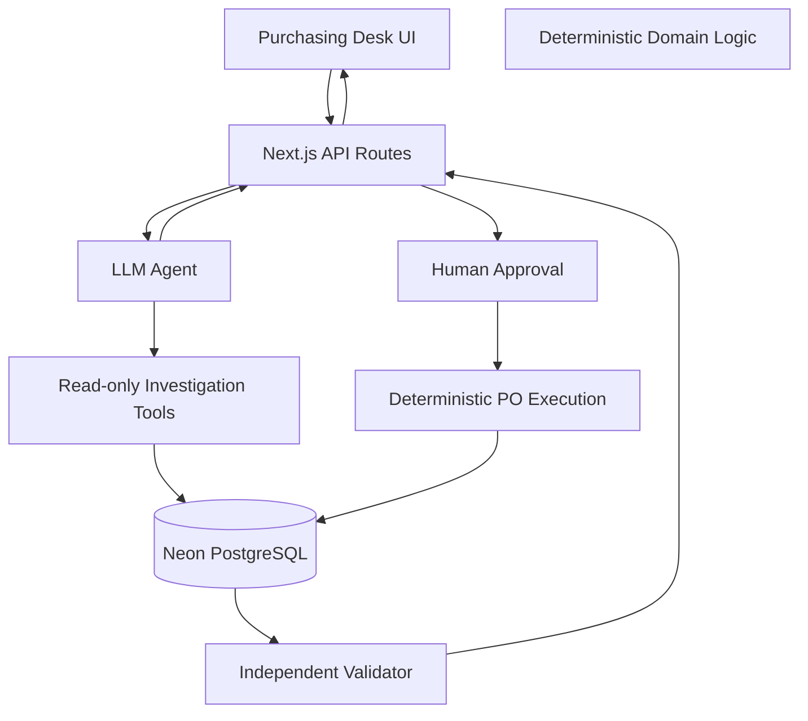

# AI Purchasing Agent

AI purchasing desk for a quick-commerce retailer where replenishment recommendations are frequently imperfect.

The system is designed around a simple principle:

> **The LLM investigates and reasons. Deterministic application code executes. An independent validator verifies the result against live database state.**

This is intentionally **not a chatbot**. The agent works as part of a purchasing workflow: it investigates the current situation using read-only tools, produces a structured purchasing decision, waits for human approval, executes the approved action through deterministic code, and independently validates the resulting state.

## Live Demo

**Production:** https://ai-purchasing-agent-eight.vercel.app

The deployed application provides a purchasing desk containing replenishment recommendations. A user can investigate a recommendation, inspect the evidence gathered by the agent, review its decision, approve the proposed action, and observe the resulting validation.

The application is deployed on Vercel and uses Neon Postgres for persistent state.

---

## What the System Does

A replenishment system proposes a quantity to purchase, but that recommendation may conflict with the actual purchasing situation.

The purchasing agent investigates factors such as:

- Current inventory
- Demand and forecast
- Existing/open purchase orders
- Supplier availability
- Supplier lead time
- Minimum order quantity (MOQ)
- Supplier lot size
- Storage capacity
- Purchasing budget
- Current database state

The agent then produces one of the supported decision outcomes:

- **ACCEPT** — accept the recommendation as-is
- **MODIFY** — change the recommended quantity or purchasing action
- **REJECT** — determine that no purchase should be made
- **INVESTIGATE** — insufficient, stale, or conflicting evidence requires further investigation

The LLM is restricted to **read-only investigation**. It does not directly create or modify purchase orders.

The execution boundary is deterministic:

```text
Recommendation
      │
      ▼
┌─────────────────────┐
│  Read-only Agent    │
│  investigation      │
└──────────┬──────────┘
           │
           ▼
┌─────────────────────┐
│ Structured Decision │
│ ACCEPT / MODIFY /   │
│ REJECT / INVESTIGATE│
└──────────┬──────────┘
           │
           ▼
     Human Approval
           │
           ▼
┌─────────────────────┐
│ Deterministic PO    │
│ Execution           │
└──────────┬──────────┘
           │
           ▼
┌─────────────────────┐
│ Independent         │
│ Validation          │
│ against live state  │
└──────────┬──────────┘
           │
      ┌────┴────┐
      ▼         ▼
   Valid      Failed
      │         │
      ▼         ▼
  Success    Failure /
             Reinvestigation
```

This separation prevents the model from having direct side effects and allows the resulting purchase order to be checked independently of the model's reasoning.

---

## Scenarios

The project contains deterministic scenario fixtures used to demonstrate different purchasing situations and agent behaviors.

| Key | Situation | Correct outcome |
|---|---|---|
| **S1-A** | 800 Wireless Earbuds Pro @ Delhi NCR | **MODIFY 250** — storage + lot-size constraints, with an existing open PO |
| **S1-B** | 800 Cola @ Mumbai West | **REJECT** — demand is already covered |
| **S1-C** | 500 Olive Oil @ Bengaluru South | **REJECT / ESCALATE** — supplier MOQ is unreachable |
| **S1-D** | 300 Whey Protein @ Hyderabad Central | **INVESTIGATE** — stale/divergent forecast evidence |
| **S1-E** | 400 Toothpaste @ Pune East | **ACCEPT 400** |
| **S2-A** | Supplier confirms only 250 of 500 AA batteries | **CREATE SUPPLEMENTARY PO 250 from Kavery** |

### What these scenarios demonstrate

**S1-A — Constraint-aware modification**

The replenishment recommendation is 800 units, but the agent must account for existing incoming inventory, storage headroom and supplier lot-size constraints before deciding what can actually be purchased.

The expected result is a modified purchase of **250 units**.

**S1-B — Reject unnecessary purchase**

The recommendation should not be blindly executed when existing inventory and demand coverage indicate that no additional purchase is required.

**S1-C — Supplier/MOQ constraint**

The desired purchase cannot be fulfilled because the available supplier's MOQ is incompatible with the purchasing situation. The appropriate action is to reject/escalate rather than fabricate an executable purchase.

**S1-D — Evidence quality**

The available forecast is stale/divergent from recent demand evidence. Instead of confidently purchasing based on questionable data, the agent should investigate further.

**S1-E — Straightforward acceptance**

The recommendation is consistent with the available purchasing situation and can be accepted without modification.

**S2-A — Supplier shortfall**

A supplier confirms only part of an existing purchase order. The system determines that the shortfall requires a supplementary purchase and selects an appropriate supplier based on the purchasing constraints.

---

## Architecture

The application is a Next.js full-stack application with a Node.js runtime.

### Main components

- **Next.js** — application UI and API routes
- **React** — purchasing desk interface
- **Prisma** — database access and persistence
- **PostgreSQL / Neon** — application state and purchasing data
- **OpenRouter** — LLM access for live agent investigation
- **Deterministic domain logic** — purchasing constraints, execution and validation
- **Replay fixtures** — deterministic agent runs for evaluation without requiring an LLM API

### High-level architecture



The detailed architecture is documented in:

- [`docs/architecture.md`](docs/architecture.md)
- [`docs/decision-spec.md`](docs/decision-spec.md)
- [`docs/evaluation.md`](docs/evaluation.md)

---

## Agent Workflow

Each investigation follows a stepped workflow rather than giving the LLM unrestricted access to the application.

### 1. Recommendation enters the purchasing desk

The system starts with an existing replenishment recommendation containing the product, node and proposed quantity.

### 2. Agent investigates

The LLM uses read-only tools to retrieve the evidence required to understand the situation.

Relevant evidence can include:

- Product and node information
- Current inventory
- Demand/forecast data
- Open purchase orders
- Supplier information
- Supplier terms
- MOQ and lot size
- Storage constraints
- Budget constraints

The agent can therefore reason about the recommendation instead of treating the proposed quantity as authoritative.

### 3. Agent produces a structured decision

The agent must produce a structured purchasing decision rather than an unstructured conversational response.

The decision can be:

```text
ACCEPT
MODIFY
REJECT
INVESTIGATE
```

The decision includes the reasoning/evidence used to reach it and the relevant purchasing constraints.

### 4. Human approval

The proposed action is presented to the user for approval.

The LLM does not directly create the purchase order.

### 5. Deterministic execution

After approval, deterministic application code performs the purchasing action.

This creates a clear boundary between:

```text
LLM reasoning
```

and

```text
real-world side effects
```

The execution layer applies the application's purchasing rules instead of trusting the model to perform database writes.

### 6. Independent validation

After execution, an independent validation step re-reads the current database state.

The validator checks the result against the expected purchasing outcome and constraints.

This is important because the world can change between:

```text
investigation → approval → execution → validation
```

The system therefore does not assume that information observed by the agent remains true indefinitely.

### 7. Handling unexpected outcomes

If validation fails, the system does not simply report a successful purchase.

The execution can be marked as failed and the workflow can support rollback/failure handling and subsequent reinvestigation.

This makes state drift and unexpected execution outcomes explicit parts of the system rather than hidden assumptions.

---

## Decision Model

The agent uses four primary decision outcomes.

### ACCEPT

The recommendation is consistent with the current purchasing situation and constraints.

Example:

```text
Recommendation: 400
Feasible purchase: 400
Decision: ACCEPT
```

### MODIFY

The recommendation should be changed because constraints or existing incoming supply affect the feasible purchase.

Example:

```text
Recommendation: 800
Feasible purchase: 250
Decision: MODIFY
Quantity: 250
```

### REJECT

The purchase should not be executed.

Examples include:

- Demand already covered
- Supplier MOQ cannot be satisfied
- Purchasing constraints make the recommendation infeasible

### INVESTIGATE

The available evidence is insufficient or unreliable.

Examples include:

- Stale forecast
- Divergence between recent demand and forecast
- Missing information required for a safe decision

More details are available in [`docs/decision-spec.md`](docs/decision-spec.md).

---

## Validation and Failure Handling

Validation is deliberately separated from the LLM decision.

The system follows:

```text
Investigate
    ↓
Decide
    ↓
Human approval
    ↓
Execute deterministically
    ↓
Re-read live state
    ↓
Validate
```

The validator does not simply trust the values that were previously shown to the agent.

Instead, it checks the resulting state using the current database state.

This allows the system to detect situations such as:

- Inventory changing after investigation
- Budget being consumed by another operation
- Supplier availability changing
- Purchasing constraints becoming unsatisfied
- Resulting PO quantity not matching the approved action

A validation failure is therefore treated as a real system outcome rather than hidden from the user.

The project also includes a simulated-spend mechanism to demonstrate state drift and validation failure behavior.

---

## Replay Mode

The project supports a replay mode for deterministic evaluation.

Replay fixtures are stored under:

```text
fixtures/
```

This allows the agent workflow to be demonstrated without requiring a live OpenRouter request.

For example:

```bash
npm run agent S1-A -- --replay
```

Replay mode is useful for:

- Reproducible evaluation
- Local development
- Testing agent decisions
- Demonstrating the workflow without an API key

Live mode uses OpenRouter and is enabled with:

```env
AGENT_MODE=live
OPENROUTER_API_KEY=...
```

---

## Testing and Evaluation

The project contains both application/domain tests and database-backed tests.

### Unit/domain tests

```bash
npm test
```

These cover deterministic domain behavior and grading/evaluation logic.

### Database tests

```bash
npm run test:db
```

These exercise behavior against the database layer.

### Agent replay

```bash
npm run agent S1-A -- --replay
```

This runs the S1-A agent workflow using replay fixtures instead of making a live LLM request.

The evaluation documentation contains more detail about the scenarios, expected outcomes and validation approach:

[`docs/evaluation.md`](docs/evaluation.md)

---

## Local Setup

### Requirements

- Node.js
- PostgreSQL-compatible database
- npm

Neon Postgres can be used for development.

### 1. Clone the repository

```bash
git clone https://github.com/TDSxJONEY/ai-purchasing-agent.git
cd ai-purchasing-agent
```

### 2. Configure environment variables

Create a local environment file:

```bash
cp .env.example .env
```

Then configure the required values.

### 3. Install dependencies

```bash
npm install
```

### 4. Generate Prisma Client

```bash
npx prisma generate
```

### 5. Push the database schema

```bash
npx prisma db push
```

### 6. Seed demo data

```bash
npm run db:seed
```

The seed creates the products, nodes, suppliers, supplier terms, inventory, forecasts, constraints, purchase orders and recommendations used by the demo scenarios.

### 7. Start the application

```bash
npm run dev
```

Open:

```text
http://localhost:3000
```

---

## Environment Variables

| Variable | Purpose |
|---|---|
| `DATABASE_URL` | Pooled Neon/Postgres connection used by the application |
| `DIRECT_URL` | Direct database connection used by Prisma schema operations |
| `OPENROUTER_API_KEY` | Required when `AGENT_MODE=live` |
| `OPENROUTER_MODEL` | LLM model used for live agent investigation |
| `AGENT_MODE` | `live` or `replay` |
| `ADMIN_SEED_TOKEN` | Protects production admin endpoints such as seed/reset and simulated spend |

Example:

```env
DATABASE_URL="..."
DIRECT_URL="..."
OPENROUTER_API_KEY="..."
OPENROUTER_MODEL="anthropic/claude-sonnet-4.5"
AGENT_MODE="live"
ADMIN_SEED_TOKEN="..."
```

Never commit `.env` or any secret credentials.

`.env.example` contains the expected configuration shape without exposing secrets.

---

## Deployment

The production application is deployed on Vercel.

### Stack

```text
Vercel
  │
  ├── Next.js application
  │
  ├── Node.js API routes
  │
  └── Prisma
          │
          ▼
      Neon PostgreSQL
```

Prisma is used with the Node.js runtime; the API routes are not configured as Edge functions.

### Vercel environment variables

Configure the following in the Vercel project:

```text
DATABASE_URL
DIRECT_URL
OPENROUTER_API_KEY
OPENROUTER_MODEL
AGENT_MODE
ADMIN_SEED_TOKEN
```

`postinstall` runs Prisma Client generation during deployment.

### Database setup

The database schema must exist in the Neon database before the application can use it.

For initial setup, run Prisma schema synchronization against the direct database connection.

The Vercel deployment does not automatically seed the demo data.

Demo data can therefore be seeded separately through the protected admin seed endpoint.

Production admin operations require the configured `ADMIN_SEED_TOKEN`.

---

## Repository Structure

```text
.
├── fixtures/                 # Replay fixtures for deterministic agent runs
├── prisma/
│   ├── schema.prisma         # Database schema
│   └── seed.ts               # Database seed entry point
├── scripts/
│   └── run-agent.ts          # CLI agent runner
├── src/
│   ├── app/
│   │   ├── api/              # API routes
│   │   └── ...               # Next.js application pages
│   ├── components/           # Purchasing desk UI components
│   ├── domain/               # Deterministic purchasing/domain logic
│   └── lib/                  # Shared application utilities and types
├── tests/
│   ├── agent.replay.itest.ts # Agent replay integration tests
│   └── grading.test.ts       # Deterministic evaluation tests
├── docs/
│   ├── architecture.md       # Detailed architecture
│   ├── decision-spec.md      # Decision rules/specification
│   └── evaluation.md        # Evaluation and test approach
├── .env.example
├── package.json
└── README.md
```

---

## Engineering Principles

The implementation intentionally separates probabilistic reasoning from deterministic side effects.

### Read-only AI investigation

The LLM can inspect purchasing information and reason about constraints, but does not directly write purchase orders.

### Human-in-the-loop execution

A human reviews and approves the proposed purchasing action before execution.

### Deterministic side effects

Purchase order creation and modification are handled by application code rather than generated model output.

### Independent validation

The resulting state is checked independently after execution using live database state.

### Explicit constraint handling

The system considers purchasing constraints such as:

- Inventory
- Demand
- Open POs
- Supplier availability
- MOQ
- Lot size
- Storage
- Budget

### Failure is a first-class outcome

If the expected result cannot be validated, the system surfaces the failure instead of treating the operation as successful.

### Reproducible evaluation

Replay fixtures allow the agent workflow to be evaluated without depending on a live LLM response.

---

## Assignment Alignment

The project focuses on the core requirement of building a purchasing agent that can:

1. Investigate a purchasing situation
2. Gather the information required for a decision
3. Reason about multiple purchasing constraints
4. Produce an appropriate decision
5. Request human approval
6. Execute the approved purchasing action
7. Independently validate the resulting state
8. Handle unexpected outcomes instead of blindly assuming success

The implementation deliberately prioritizes **correct decision boundaries, deterministic execution and validation** over building a general-purpose conversational assistant.

---

## Links

- **Live Demo:** https://ai-purchasing-agent-eight.vercel.app
- **GitHub:** https://github.com/TDSxJONEY/ai-purchasing-agent
- **Architecture:** [`docs/architecture.md`](docs/architecture.md)
- **Decision Specification:** [`docs/decision-spec.md`](docs/decision-spec.md)
- **Evaluation:** [`docs/evaluation.md`](docs/evaluation.md)

---

## License

This project was created as an engineering assessment/demo project.